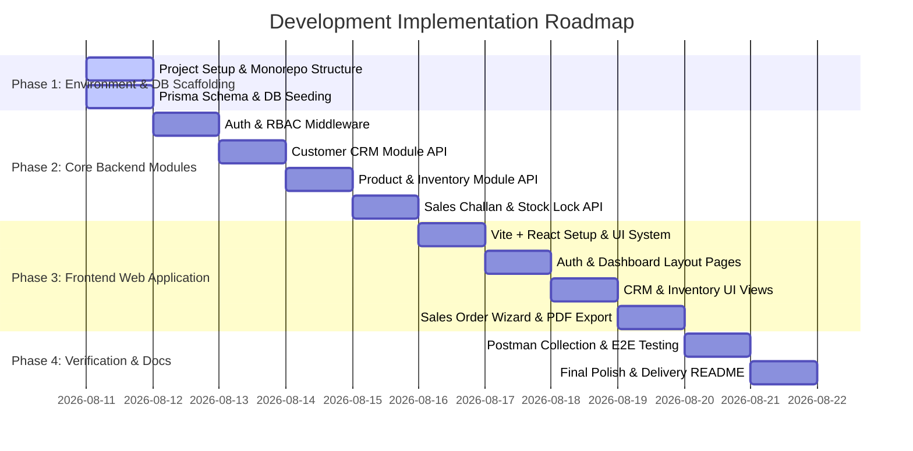

# Development Implementation Plan: Mini ERP + CRM Portal

## 1. Executive Summary & Strategy
This document outlines the step-by-step development roadmap for constructing the **Mini ERP + CRM Operations Portal**. The implementation follows a modular, feature-driven architecture where backend API services and database models are built, tested, and validated phase-by-phase before connecting the frontend UI components.

---

## 2. Implementation Phasing & Milestones

---

## 3. Phase Breakdown & Execution Checklists

### Phase 1: Environment Setup & Database Scaffolding
**Goal**: Establish clean backend & frontend folder structures and set up database schema with Prisma ORM.

- [ ] **Task 1.1**: Initialize directory structure in `C:\Users\sachi\Desktop\f\mini-erp-crm`:
  - `backend/`: Node.js, Express, TypeScript, ts-node-dev, dotenv.
  - `frontend/`: Vite, React 18, TypeScript, Tailwind CSS, Lucide React icons.
- [ ] **Task 1.2**: Configure TypeScript (`tsconfig.json`), ESLint, and environment configurations (`.env.example`).
- [ ] **Task 1.3**: Author Prisma Schema (`backend/prisma/schema.prisma`):
  - Models: `User`, `Customer`, `CustomerNote`, `Product`, `StockMovement`, `SalesChallan`, `ChallanItem`.
  - Enums: `Role`, `CustomerType`, `CustomerStatus`, `MovementType`, `ChallanStatus`.
- [ ] **Task 1.4**: Run Initial Migration & Seed Script (`backend/prisma/seed.ts`):
  - Provision test users for all 4 roles (`ADMIN`, `SALES`, `WAREHOUSE`, `ACCOUNTS`).
  - Seed sample customers, product catalog items, and stock levels.

---

### Phase 2: Core Backend API Modules
**Goal**: Build modular Express controllers, services, repositories, and middlewares.

#### Module 2.1: Authentication & Authorization
- [ ] Implement `auth.middleware.ts` to verify Bearer JWT tokens.
- [ ] Implement `role.middleware.ts` for strict RBAC endpoint protection.
- [ ] Build `/api/v1/auth/login` and `/api/v1/auth/me` endpoints with bcrypt password comparison.

#### Module 2.2: Customer CRM Module
- [ ] Implement `customer.repository.ts` & `customer.service.ts` for CRUD operations.
- [ ] Implement search query filtering (`name`, `businessName`, `email`, `mobile`) and pagination.
- [ ] Build note timeline endpoint `/api/v1/customers/:id/notes` for logging follow-up interactions.

#### Module 2.3: Product Catalog & Inventory Audit Module
- [ ] Implement `product.repository.ts` with low-stock calculation (`currentStock <= minStockAlert`).
- [ ] Implement manual stock adjustment endpoint `/api/v1/products/:id/stock` (`IN` / `OUT`).
- [ ] Create immutable `StockMovement` audit trail tracking reason, quantity, and authorizing user.

#### Module 2.4: Sales Challan & Concurrency Control
- [ ] Build `/api/v1/challans` endpoint for creating orders in `DRAFT` or `CONFIRMED` state.
- [ ] Implement product metadata snapshotting (`snapshotProductName`, `snapshotSku`, `snapshotUnitPrice`).
- [ ] Implement **Atomic Stock Lock**:
  - Run inside `prisma.$transaction`.
  - Apply `SELECT FOR UPDATE` on product rows.
  - Verify stock availability; rollback with `400 Bad Request` if insufficient.
  - Deduct stock and log `StockMovement(OUT)` on confirmation.
- [ ] Implement PDF Invoice endpoint `/api/v1/challans/:id/pdf` using PDFKit / Puppeteer.

---

### Phase 3: Frontend Application & UI Components
**Goal**: Build a high-performance React dashboard with role-aware UI elements and instant feedback.

#### Component & Layout Infrastructure
- [ ] Setup Axios base API client (`frontend/src/services/api.ts`) with request interceptors for JWT.
- [ ] Build `AuthContext.tsx` to handle token storage, role extraction, and automatic logout.
- [ ] Build `DashboardLayout.tsx` with responsive sidebar, navbar header, and role badge display.

#### Feature Views
- [ ] **Login Page**: Interactive role selector buttons to quick-fill demo credentials.
- [ ] **Dashboard View**: Metric KPI summary cards (Total Revenue, Active Leads, Low Stock Warnings).
- [ ] **Customer CRM View**: Data grid, status filters (`LEAD`, `ACTIVE`, `INACTIVE`), modal for new customer registration, slide-over note drawer.
- [ ] **Inventory Catalog View**: Product grid/table, stock alert badges, manual stock adjustment modal.
- [ ] **Sales Challan View**: Dynamic order creation wizard, line-item selector, real-time total calculation, stock check status indicators, and client-side/server-side PDF download action.

---

### Phase 4: Quality Assurance, API Collection & Documentation
**Goal**: Validate all business flows, error conditions, and deliver production-ready documentation.

- [ ] Execute automated test suite (`backend/tests`):
  - Auth token issuance & permission guards.
  - Concurrency stock deduction tests (verifying negative stock is rejected).
- [ ] Generate Postman API Collection (`postman/mini-erp-crm.postman_collection.json`) with sample requests for all endpoints.
- [ ] Finalize root `README.md` with complete local startup commands, environment variables guide, and architecture overview.

---

## 4. Immediate Action Plan

| Step | Action | Status |
| :--- | :--- | :---: |
| **Step 1** | Scaffold `backend/` & `frontend/` directory structure | ⏳ Pending |
| **Step 2** | Setup Prisma DB schema & seed default role accounts | ⏳ Pending |
| **Step 3** | Implement Express Auth & Role Guard middlewares | ⏳ Pending |
| **Step 4** | Implement Customer, Product, Inventory & Challan APIs | ⏳ Pending |
| **Step 5** | Build React Frontend UI & Connect REST Endpoints | ⏳ Pending |
