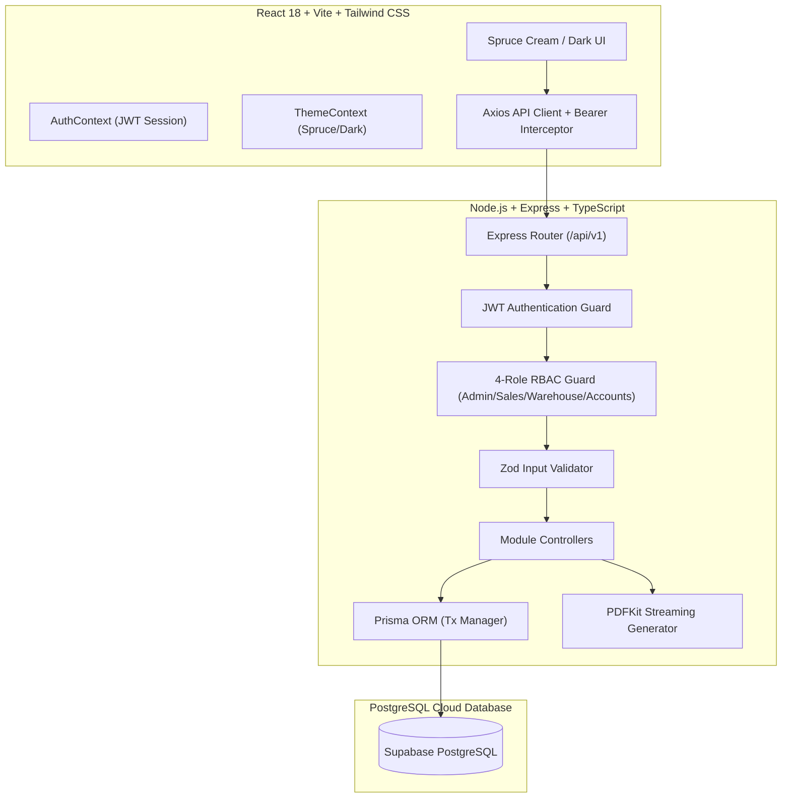

# Executive Submission Package: Mini ERP + CRM Operations Portal

> **Project Name**: Mini ERP + CRM Operations Portal  
> **Repository**: [`Sachinpd1703/mini-erp-crm`](https://github.com/Sachinpd1703/mini-erp-crm)  
> **Architecture Level**: Production-Grade Full-Stack Enterprise Portal  
> **Deliverable Version**: 1.0.0  

---

## 📋 Executive Summary
The **Mini ERP + CRM Operations Portal** is an end-to-end distribution and order fulfillment system designed for B2B enterprises managing customers, product inventory, warehouse stock movements, and sales order execution. 

Built with **Node.js, Express, TypeScript, Prisma ORM, PostgreSQL (Supabase), React 18, Vite, and Tailwind CSS**, the application delivers a seamless experience with **strict 4-Role Access Control (RBAC)**, **atomic transaction locks preventing inventory overselling**, **dynamic PDF invoice generation**, and a custom **Spruce Cream & Dark Mode design system**.

---

## 🏗️ System Architecture & Technology Stack



### Stack Justification
- **Backend Core**: Express.js with TypeScript for typed API contracts and rapid request handling.
- **Database & ORM**: PostgreSQL paired with Prisma ORM for type-safe schema migrations, database seeding, and ACID-compliant atomic transactions.
- **Frontend Core**: React 18 powered by Vite for instant hot-module reloading and optimized production bundles (`7.5s` build time).
- **Design System**: Custom CSS variables + Tailwind CSS implementing a dual-mode palette (**Spruce Cream Mode** `#002A1C`/`#FFFBF7`/`#FFE4C4`/`#F3CEA6` and **Dark Mode** `#0B0F17`/`#021811`).

---

## 🔑 Key Engineering & Technical Highlights

### 1. Atomic Stock Locks & Zero-Oversell Guarantee (`prisma.$transaction`)
Order confirmation is protected against race conditions and concurrent double-fulfillment. When a Sales Challan is confirmed:
1. An isolated transaction lock is acquired.
2. Current stock is queried for all line items.
3. If requested quantity exceeds available stock, the transaction immediately rolls back with `400 INSUFFICIENT_STOCK`.
4. If valid, product stock is decremented and immutable `StockMovement` audit logs (`OUT`) are generated atomically.

### 2. Strict 4-Role Granular RBAC
The system enforces strict permission boundaries across 4 distinct enterprise roles:

| Module / Endpoint | ADMIN | SALES | WAREHOUSE | ACCOUNTS |
| :--- | :---: | :---: | :---: | :---: |
| **Auth & Me Profile** | ✅ | ✅ | ✅ | ✅ |
| **View Customers & Timeline** | ✅ | ✅ | ✅ | ✅ |
| **Create / Edit Customers** | ✅ | ✅ | ❌ | ❌ |
| **View Product Catalog** | ✅ | ✅ | ✅ | ✅ |
| **Adjust Stock (IN/OUT)** | ✅ | ❌ | ✅ | ❌ |
| **View Inventory Audit Trail** | ✅ | ❌ | ✅ | ✅ |
| **Create Sales Order (Challan)** | ✅ | ✅ | ❌ | ❌ |
| **Confirm / Cancel Challan** | ✅ | ✅ | ❌ | ❌ |
| **Download PDF Invoice** | ✅ | ✅ | ✅ | ✅ |

### 3. Dynamic PDF Invoice Streaming Engine
Integrated backend `pdfkit` generator that constructs dynamic GST invoice documents on the fly via `/api/v1/challans/:id/pdf`. The frontend automatically handles authentication headers and triggers direct binary PDF blob downloads.

---

## 📁 Repository & Documentation Directory

The repository includes a comprehensive, modular documentation suite located in [`docs/`](file:///C:/Users/sachi/Desktop/f/mini-erp-crm/docs):

```
docs/
├── EXECUTIVE_SUBMISSION_PACKAGE.md  <-- Master Submission Overview
├── DEVELOPMENT_PLAN.md              <-- Phase-by-phase Execution Plan
├── THEME_IMPLEMENTATION_PLAN.md      <-- Custom Color Palette & Dark Engine Specs
├── Recommended project structure.txt
└── PRD/
    ├── 01-master-prd.md             <-- Core Architecture & System Requirements
    ├── 02-auth-rbac-prd.md          <-- Authentication & RBAC Matrix
    ├── 03-customer-crm-prd.md       <-- Customer Profiles & Lead Log Timeline
    ├── 04-product-inventory-prd.md  <-- Catalog, Thresholds & Audit Trail
    ├── 05-sales-challan-prd.md      <-- Order Wizard & Atomic Deductions
    ├── 06-api-specification-prd.md  <-- REST API Contract & Payloads
    ├── 07-frontend-prd.md           <-- React Design System & Pages
    ├── 08-delivery-and-documentation-prd.md <-- Postman & Verification
    └── README.md
```

---

## 🧪 Postman Test Collection

Pre-configured Postman collection provided in [`postman/mini-erp-crm.postman_collection.json`](file:///C:/Users/sachi/Desktop/f/mini-erp-crm/postman/mini-erp-crm.postman_collection.json):
- Includes automated environment variables (`{{baseUrl}}`, `{{authToken}}`).
- Auto-saves JWT tokens upon executing `/api/v1/auth/login`.
- Covers all 15 REST endpoints including authentication failures, low-stock query filters, note additions, status transitions, and PDF streaming.

---

## ⚡ Quick Start & Evaluator Verification Guide

### 1. Backend Service
```bash
cd backend
npm install
# Set DATABASE_URL in .env (PostgreSQL / Supabase)
npx prisma db push
npx prisma db seed
npm run dev
```
*Backend runs on `http://localhost:5000`*

### 2. Frontend Application
```bash
cd frontend
npm install
npm run dev
```
*Frontend runs on `http://localhost:3000`*

### 3. Evaluator Test Accounts (Pre-Seeded)
The login screen features **Quick-Fill Demo Role Buttons** for one-click testing:

- **Admin**: `admin@minierp.com` / `Admin123!`
- **Sales**: `sales@minierp.com` / `Sales123!`
- **Warehouse**: `warehouse@minierp.com` / `Warehouse123!`
- **Accounts**: `accounts@minierp.com` / `Accounts123!`

---

## 🎯 Case Study Requirements Compliance Checklist

- [x] **Customer CRM Module**: Complete with company names, lead conversion statuses (`LEAD`, `ACTIVE`, `INACTIVE`), customer types (`RETAIL`, `WHOLESALE`, `DISTRIBUTOR`), and follow-up timeline drawer.
- [x] **Product & Inventory Module**: Complete with SKU search, unit pricing, low-stock threshold alert banners, manual stock adjustment modal (`IN`/`OUT`), and immutable movement audit trail.
- [x] **Sales Challan Fulfillment**: Multi-item order wizard with live stock availability verification, grand total calculation, status toggle (`DRAFT` ➔ `CONFIRMED`), and atomic stock locks.
- [x] **PDF Invoice Streamer**: Computer-generated PDF invoices with company headers, GST line items, and total calculations.
- [x] **RBAC & Authentication**: JWT authentication with 4-role permission guards enforced across all API endpoints and frontend navigation menus.
- [x] **Professional UI Aesthetics**: Built with custom **Spruce Cream Light Mode** (`#FFFBF7` canvas, `#002A1C` sidebar/topbar, `#FFE4C4` cards, `#F3CEA6` borders) and a one-click **Dark Mode** toggle.
