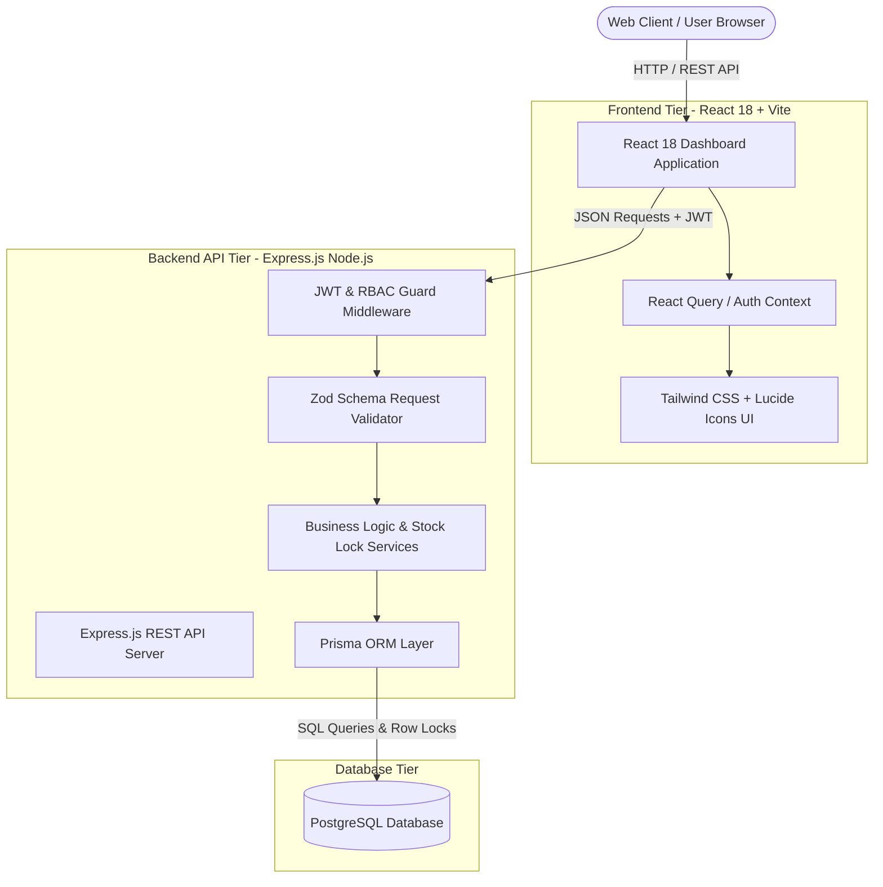
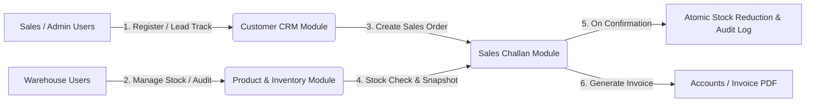

# Master Product Requirement Document (PRD): Mini ERP + CRM Operations Portal

## 1. Executive Summary
The **Mini ERP + CRM Operations Portal** is an end-to-end operational software platform engineered for wholesale and distribution enterprises. The system integrates Customer Relationship Management (CRM), Product & Inventory Lifecycle Management, Stock Audit Movement Tracking, and Sales Order Fulfillment (Sales Challan generation) into a unified, secure, real-time portal.

The goal is to deliver an enterprise-grade, high-performance, modular full-stack solution with complete transaction safety, strict Role-Based Access Control (RBAC), and deployment readiness within a 48-hour timeline.

---

## 2. Business Objectives & Key Metrics
- **Order Processing Speed**: Reduce order creation to fulfillment cycle time by 60%.
- **Inventory Accuracy**: Zero stock discrepancies by recording immutable `IN` and `OUT` stock movement audit logs.
- **Transaction Safety**: 100% elimination of negative stock overselling through database row-level locking.
- **Customer Follow-Up Tracking**: Increase sales conversion by structured lead tracking and follow-up schedules.

---

## 3. High-Level System Architecture & Scope

### Module Relationship & Core Business Flow

---

## 4. Operational Roles & Responsibilities Matrix

| Module | Admin | Sales | Warehouse | Accounts |
| :--- | :---: | :---: | :---: | :---: |
| **User & RBAC Management** | Full (CRUD) | None | None | None |
| **Customer CRM & Notes** | Full (CRUD) | Create/Edit/Search | Read-Only | Read-Only |
| **Product Catalog** | Full (CRUD) | Read-Only | Create/Edit/Search | Read-Only |
| **Inventory Stock Movements** | Full Audit | Read-Only | Create (IN/OUT) | Read-Only |
| **Sales Challans (Draft)** | Create/Edit | Create/Edit | Read-Only | Read-Only |
| **Sales Challans (Confirm)**| Confirm | Confirm | View Order | Audit/PDF |

---

## 5. Summary of PRD Modular Suite
This Master PRD serves as the entry point. Detailed subsystem specifications are divided into:
- [**02-auth-rbac-prd.md**](./02-auth-rbac-prd.md): User authentication, JWT tokens, password hashing, and middleware guards.
- [**03-customer-crm-prd.md**](./03-customer-crm-prd.md): Lead lifecycle, customer profiles, contact info, and follow-up note tracking.
- [**04-product-inventory-prd.md**](./04-product-inventory-prd.md): Product catalog management, SKU indexing, and stock movement logs.
- [**05-sales-challan-prd.md**](./05-sales-challan-prd.md): Multi-item sales orders, price & metadata snapshotting, atomic stock deduction.
- [**06-api-specification-prd.md**](./06-api-specification-prd.md): Complete RESTful API contracts, status codes, request/response formats.
- [**07-frontend-prd.md**](./07-frontend-prd.md): User interface design system, state management, pages, and interactive workflows.
- [**08-delivery-and-documentation-prd.md**](./08-delivery-and-documentation-prd.md): Testing, deployment strategies, seed data, and deliverable checklists.
