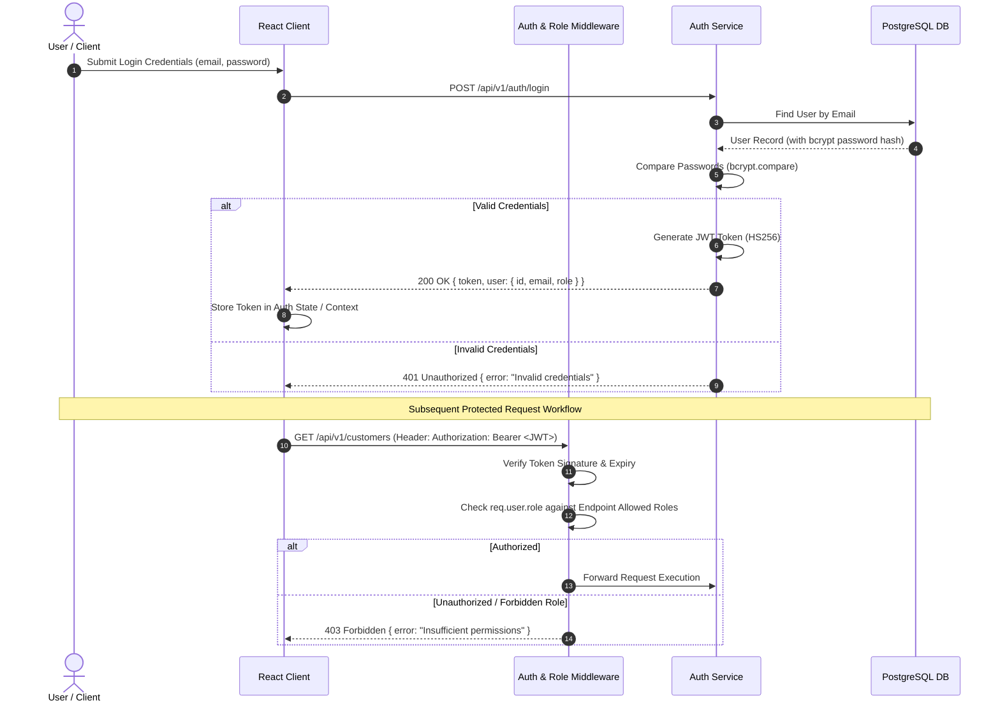

# Subsystem PRD: Authentication & Role-Based Access Control (RBAC)

## 1. Feature Overview
The Authentication & RBAC subsystem provides secure identity verification and authorization services. It ensures that internal employees access only the capabilities mandated by their organizational role.

---

## 2. Technical Specifications & Requirements

### 2.1 Supported Roles
1. **ADMIN**: Full administrative control over all resources, users, and audit logs.
2. **SALES**: Responsible for managing customer leads, logging follow-ups, creating and confirming sales challans.
3. **WAREHOUSE**: Responsible for managing inventory, logging incoming stock and stock adjustments.
4. **ACCOUNTS**: Responsible for viewing financial order summaries, checking customer details, and generating invoice PDFs.

### 2.2 Security Architecture & Sequence Flow



- **Password Hashing**: Passwords stored using `bcrypt` with a minimum salt factor of 10.
- **JWT Token Specification**:
  - Algorithm: `HS256`
  - Expiry: 8 Hours (default session duration)
  - Payload: `{ userId: string, email: string, role: string, iat: number, exp: number }`
- **Header Structure**: `Authorization: Bearer <token>`

---

## 3. Data Model & Schema

```prisma
enum Role {
  ADMIN
  SALES
  WAREHOUSE
  ACCOUNTS
}

model User {
  id           String          @id @default(uuid())
  email        String          @unique
  passwordHash String
  fullName     String
  role         Role            @default(SALES)
  createdAt    DateTime        @default(now())
  updatedAt    DateTime        @updatedAt

  customerNotes  CustomerNote[]
  stockMovements StockMovement[]
  salesChallans  SalesChallan[]

  @@map("users")
}
```

---

## 4. API & Middleware Behavior

### 4.1 Endpoints
- `POST /api/v1/auth/login`
  - Input: `{ email, password }`
  - Success Response (`200 OK`): `{ token, user: { id, email, fullName, role } }`
  - Error Response (`401 Unauthorized`): Invalid credentials message.
- `GET /api/v1/auth/me`
  - Auth: Required (Bearer JWT)
  - Success Response (`200 OK`): Returns current user payload.

### 4.2 Middleware Pipeline
1. `auth.middleware.ts`: Extracts JWT from `Authorization` header, verifies signature, injects `req.user`.
2. `role.middleware.ts`: Accepts allowed roles array `(roles: Role[])`. If `req.user.role` is not in allowed list, returns `403 Forbidden`.

---

## 5. Pre-seeded Test Accounts
The system seed script automatically provisions the following default credentials for evaluation:

| Role | Email | Password |
| :--- | :--- | :--- |
| **Admin** | `admin@minierp.com` | `Admin123!` |
| **Sales** | `sales@minierp.com` | `Sales123!` |
| **Warehouse** | `warehouse@minierp.com` | `Warehouse123!` |
| **Accounts** | `accounts@minierp.com` | `Accounts123!` |
