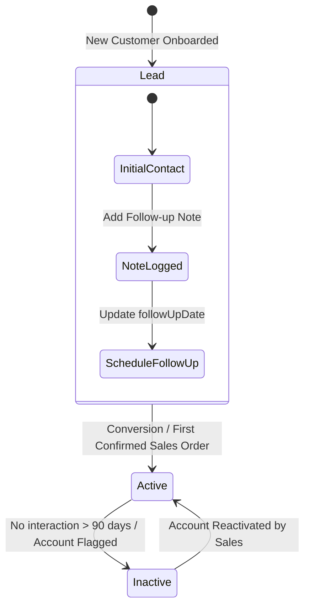
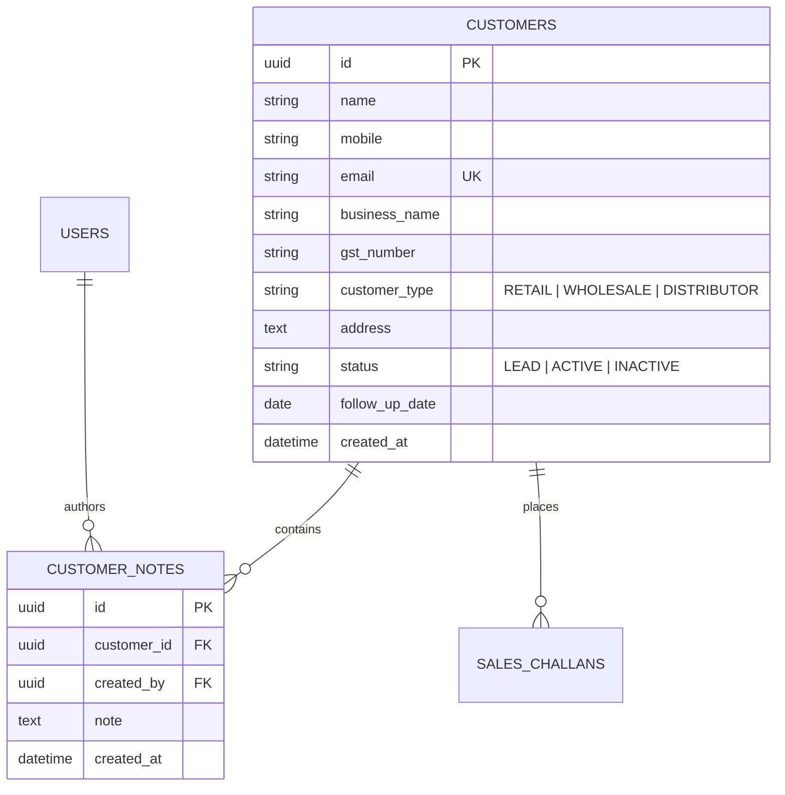

# Subsystem PRD: Customer CRM Module

## 1. Module Scope & Goal
The Customer CRM Module enables sales representatives and account managers to register business clients, track leads, record interaction notes, and maintain contact information.

---

## 2. Core Functional Requirements

### 2.1 Customer Lead Lifecycle State Diagram



### 2.2 Entity Relationship Diagram (CRM Module)



### 2.3 Customer Fields & Validation

| Field Name | Type | Validation / Constraints | Required |
| :--- | :--- | :--- | :---: |
| `name` | String | Trimmed, non-empty (2-100 chars) | Yes |
| `mobile` | String | Valid phone number format (10-15 digits) | Yes |
| `email` | String | Unique, valid email syntax | Yes |
| `businessName` | String | Non-empty company name | Yes |
| `gstNumber` | String | Optional 15-character alphanumeric GSTIN format | No |
| `customerType` | Enum | `RETAIL`, `WHOLESALE`, `DISTRIBUTOR` | Yes |
| `address` | Text | Street, city, state, postal code | Yes |
| `status` | Enum | `LEAD`, `ACTIVE`, `INACTIVE` | Yes (Default: `LEAD`) |
| `followUpDate` | Date | Optional ISO timestamp for future action | No |

### 2.2 Follow-Up Notes Log
- Every customer record maintains an appendable timeline of interaction notes (`CustomerNote`).
- Each note records the text content, author (`userId`), and timestamp (`createdAt`).
- Sales agents can append notes when updating customer status or follow-up schedules.

---

## 3. Data Model

```prisma
enum CustomerType {
  RETAIL
  WHOLESALE
  DISTRIBUTOR
}

enum CustomerStatus {
  LEAD
  ACTIVE
  INACTIVE
}

model Customer {
  id           String         @id @default(uuid())
  name         String
  mobile       String
  email        String         @unique
  businessName String
  gstNumber    String?
  customerType CustomerType   @default(RETAIL)
  address      String
  status       CustomerStatus @default(LEAD)
  followUpDate DateTime?
  createdAt    DateTime       @default(now())
  updatedAt    DateTime       @updatedAt

  notes         CustomerNote[]
  salesChallans SalesChallan[]

  @@map("customers")
}

model CustomerNote {
  id         String   @id @default(uuid())
  customerId String
  createdBy  String
  note       String   @db.Text
  createdAt  DateTime @default(now())

  customer Customer @relation(fields: [customerId], references: [id], onDelete: Cascade)
  author   User     @relation(fields: [createdBy], references: [id])

  @@map("customer_notes")
}
```

---

## 4. Key Workflows & Operations

### 4.1 Search & Filter Capabilities
- Search query matches against `name`, `businessName`, `email`, and `mobile`.
- Filters available by `status` (`LEAD`, `ACTIVE`, `INACTIVE`) and `customerType`.
- Results paginated with configurable `page` (default: 1) and `limit` (default: 10).

### 4.2 Customer Detail View
- Displays complete customer demographic and contact info.
- Chronological timeline of all logged notes.
- Summary list of linked Sales Challans (Draft & Confirmed) with status indicators.
