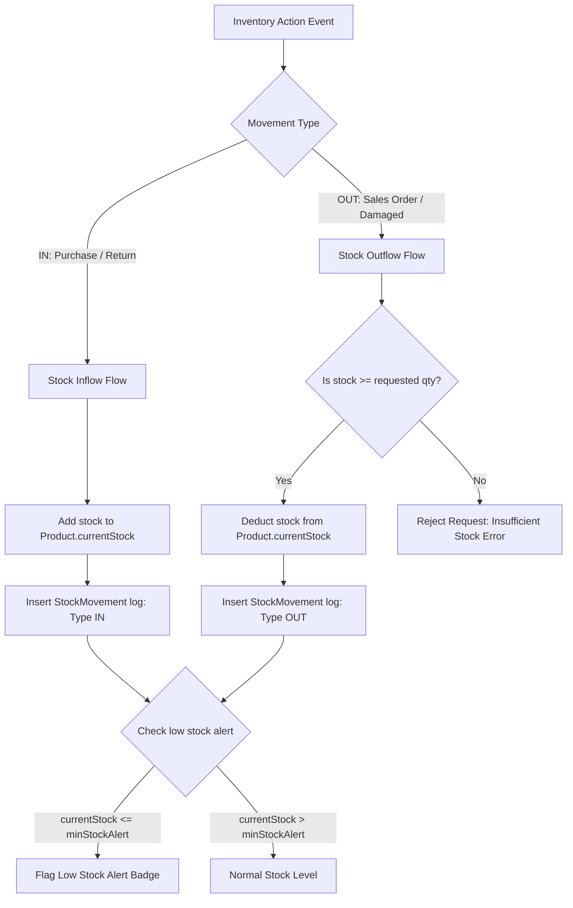
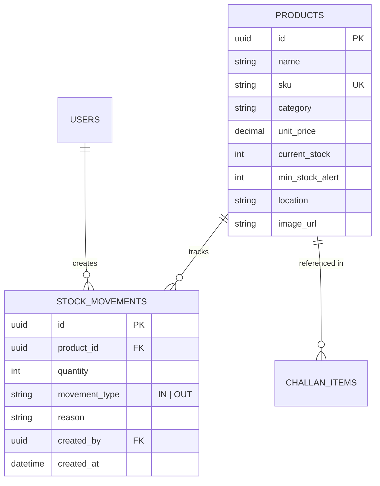

# Subsystem PRD: Product Catalog & Inventory Module

## 1. Module Scope & Goal
The Product Catalog & Inventory Module manages product master data, unit pricing, warehouse stocking, low-stock alerts, and detailed audit trail logs for all stock movements (`IN` / `OUT`).

---

## 2. Core Specifications

### 2.1 Inventory Audit Movement Flowchart



### 2.2 Product & Inventory ERD



### 2.3 Product Catalog Fields

| Field Name | Type | Description / Constraints | Required |
| :--- | :--- | :--- | :---: |
| `name` | String | Product title / description | Yes |
| `sku` | String | Unique Stock Keeping Unit (Unique index) | Yes |
| `category` | String | Product group / classification | Yes |
| `unitPrice` | Decimal | Base sales price (2 decimal precision) | Yes |
| `currentStock` | Integer | Total units on hand (Non-negative) | Yes (Default: 0) |
| `minStockAlert` | Integer | Minimum threshold triggering low-stock alert | Yes (Default: 5) |
| `location` | String | Warehouse aisle / bin designation (e.g. `Rack-A4`) | No |
| `imageUrl` | String | AWS S3 image URL or asset link | No |

---

### 2.2 Stock Movement Log (Audit Trail)
To maintain complete accountability, manual inventory changes and order fulfillment deductions create immutable `StockMovement` records:

- `productId`: FK to target Product.
- `quantity`: Positive integer quantity added or removed.
- `movementType`: Enum (`IN` for stock additions, `OUT` for order fulfillment or removals).
- `reason`: Explanation (e.g., `"Initial Purchase Stock"`, `"Sales Challan CH-202608-0001"`, `"Damaged Goods Adjustment"`).
- `createdBy`: FK to User who authorized the movement.
- `createdAt`: Auto timestamp.

---

## 3. Data Model

```prisma
enum MovementType {
  IN
  OUT
}

model Product {
  id            String   @id @default(uuid())
  name          String
  sku           String   @unique
  category      String
  unitPrice     Decimal  @db.Decimal(10, 2)
  currentStock  Int      @default(0)
  minStockAlert Int      @default(5)
  location      String?
  imageUrl      String?
  createdAt     DateTime @default(now())
  updatedAt     DateTime @updatedAt

  stockMovements StockMovement[]
  challanItems   ChallanItem[]

  @@map("products")
}

model StockMovement {
  id           String       @id @default(uuid())
  productId    String
  quantity     Int
  movementType MovementType
  reason       String
  createdBy    String
  createdAt    DateTime     @default(now())

  product Product @relation(fields: [productId], references: [id])
  author  User    @relation(fields: [createdBy], references: [id])

  @@map("stock_movements")
}
```

---

## 4. Key Business Logic & Alerting
- **Low Stock Indicator**: Products where `currentStock <= minStockAlert` are flagged with a low-stock alert badge on the frontend UI and backend API filters.
- **Stock Audit Integrity**: Every automated deduction (Sales Challan confirmation) or manual adjustment triggers a single transaction creating a `StockMovement` row and updating `Product.currentStock`.
