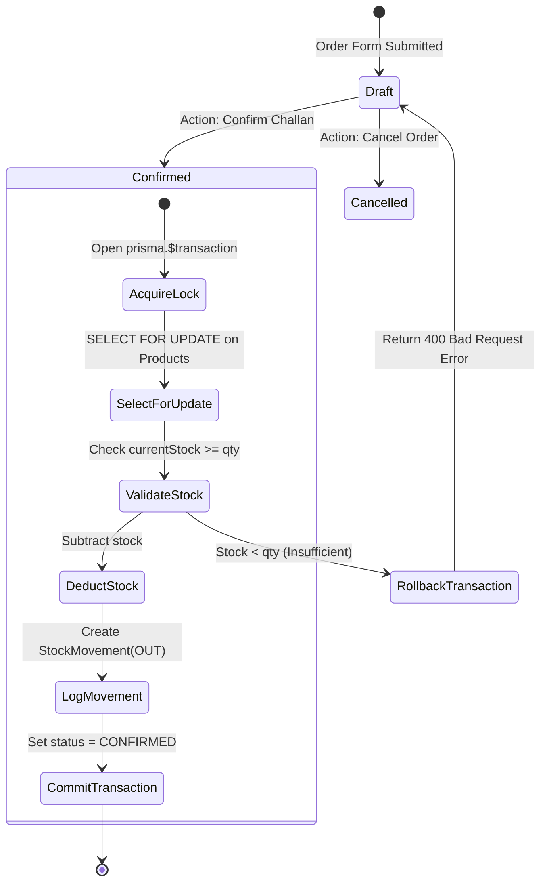
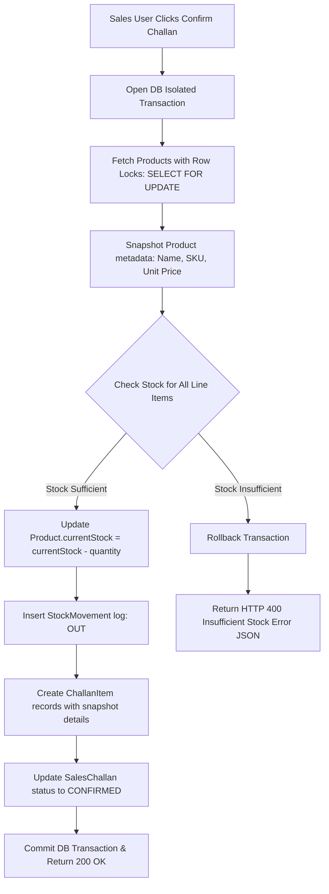

# Subsystem PRD: Sales Challan Module

## 1. Module Scope & Business Goal
The Sales Challan Module governs the creation, confirmation, stock allocation, and invoice generation for customer sales orders. It ensures strict inventory integrity through historical metadata snapshotting and atomic database transaction locks.

---

## 2. Core Functional Requirements

### 2.1 Sales Challan Lifecycle State Machine



### 2.2 Product Snapshot & Concurrency Flowchart



### 2.3 Product Snapshot Business Rule
**Critical Requirement**: When a Sales Challan is created or confirmed, product details (`name`, `sku`, `unitPrice`) MUST be snapshotted into `ChallanItem`. 
*Rationale*: Future price updates or changes to product catalog names must never retroactively modify past sales orders or historical invoices.

---

## 3. Concurrency & Negative Stock Protection

To guarantee that inventory is never reduced below zero when multiple sales agents submit orders simultaneously:

1. **Transaction Isolation**: Confirmation runs inside a `prisma.$transaction`.
2. **Row Locking**: Row-level locks (`SELECT ... FOR UPDATE`) lock target product rows.
3. **Validation & Atomic Rollback**:
   - For each requested line item, system checks: `if (product.currentStock < item.quantity)`.
   - If stock is insufficient, transaction aborts immediately with `HTTP 400 Bad Request`.
   - Error response contains SKU and available vs requested quantities.
   - If stock is sufficient:
     - Decrements `product.currentStock`.
     - Creates `StockMovement` log with `movementType: OUT`.
     - Updates Challan status to `CONFIRMED`.

---

## 4. Data Model

```prisma
enum ChallanStatus {
  DRAFT
  CONFIRMED
  CANCELLED
}

model SalesChallan {
  id            String        @id @default(uuid())
  challanNumber String        @unique
  customerId    String
  status        ChallanStatus @default(DRAFT)
  totalAmount   Decimal       @db.Decimal(10, 2)
  totalQuantity Int
  createdBy     String
  createdAt     DateTime      @default(now())
  updatedAt     DateTime      @updatedAt

  customer Customer      @relation(fields: [customerId], references: [id])
  author   User          @relation(fields: [createdBy], references: [id])
  items    ChallanItem[]

  @@map("sales_challans")
}

model ChallanItem {
  id                  String       @id @default(uuid())
  salesChallanId      String
  productId           String
  snapshotProductName String
  snapshotSku         String
  snapshotUnitPrice   Decimal      @db.Decimal(10, 2)
  quantity            Int
  lineTotal           Decimal      @db.Decimal(10, 2)

  salesChallan SalesChallan @relation(fields: [salesChallanId], references: [id], onDelete: Cascade)
  product      Product      @relation(fields: [productId], references: [id])

  @@map("challan_items")
}
```

---

## 5. Challan Number Generation Rule
- Automatically generated sequential code format: `CH-YYYYMM-XXXX` (e.g., `CH-202608-0001`).
- Ensured unique via database unique constraint and transaction incrementing.
