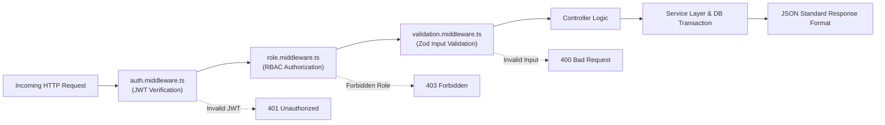

# Subsystem PRD: REST API Specification

## 1. Global API Standards



- **Base URL**: `/api/v1`
- **Format**: JSON (`Content-Type: application/json`)
- **Authentication**: `Authorization: Bearer <jwt-token>`
- **Response Structure**:
  ```json
  {
    "success": true,
    "data": { ... },
    "meta": { "page": 1, "limit": 10, "total": 45 },
    "error": null
  }
  ```
- **Error Response Structure**:
  ```json
  {
    "success": false,
    "data": null,
    "error": {
      "code": "INSUFFICIENT_STOCK",
      "message": "Stock for item PROD-001 is insufficient (Available: 3, Requested: 10)",
      "details": []
    }
  }
  ```

---

## 2. API Endpoints Table

| Category | Endpoint | Method | Allowed Roles | Description |
| :--- | :--- | :---: | :--- | :--- |
| **Auth** | `/auth/login` | `POST` | Public | Authenticate user & return JWT token |
| **Auth** | `/auth/me` | `GET` | All Roles | Fetch current logged-in profile |
| **CRM** | `/customers` | `GET` | All Roles | List customers (Search, filter, paginate) |
| **CRM** | `/customers` | `POST` | Admin, Sales | Create customer record |
| **CRM** | `/customers/:id` | `GET` | All Roles | Get customer details, timeline & challans |
| **CRM** | `/customers/:id` | `PUT` | Admin, Sales | Update customer profile / status |
| **CRM** | `/customers/:id/notes` | `POST` | Admin, Sales | Append follow-up note to customer |
| **Products** | `/products` | `GET` | All Roles | List products (Category filter, low stock) |
| **Products** | `/products` | `POST` | Admin, Warehouse | Create product master |
| **Products** | `/products/:id` | `GET` | All Roles | Get single product detail |
| **Products** | `/products/:id` | `PUT` | Admin, Warehouse | Update product details / unit price |
| **Products** | `/products/:id/stock` | `POST` | Admin, Warehouse | Manual stock addition/removal with reason |
| **Products** | `/products/:id/movements` | `GET` | All Roles | Get stock movement audit trail |
| **Challans** | `/challans` | `GET` | All Roles | List sales challans with filters |
| **Challans** | `/challans` | `POST` | Admin, Sales | Create sales challan (Draft/Confirmed) |
| **Challans** | `/challans/:id` | `GET` | All Roles | Get detailed sales challan snapshot |
| **Challans** | `/challans/:id/status` | `PATCH` | Admin, Sales | Confirm or cancel draft challan |
| **Challans** | `/challans/:id/pdf` | `GET` | All Roles | Stream PDF invoice download |

---

## 3. Standard HTTP Status Codes
- `200 OK`: Successful retrieval / update.
- `201 Created`: Resource successfully created.
- `400 Bad Request`: Input validation error or insufficient stock.
- `401 Unauthorized`: Missing or expired JWT token.
- `403 Forbidden`: Authenticated user lacks role permission.
- `404 Not Found`: Target resource does not exist.
- `500 Internal Server Error`: Unhandled server exception.
