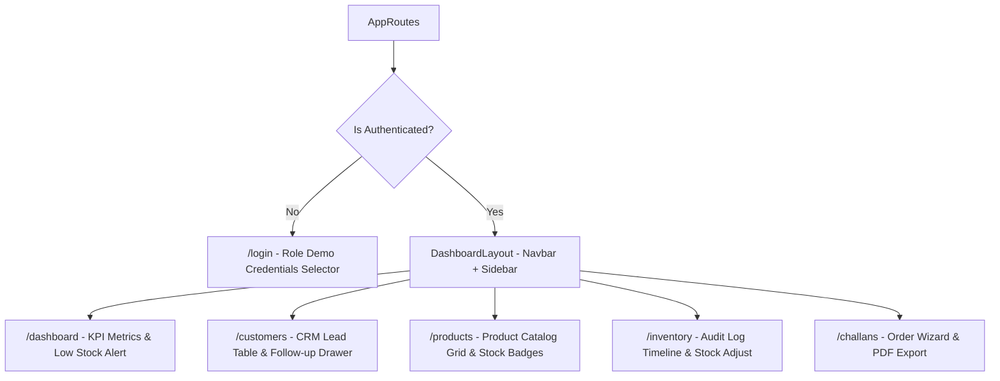
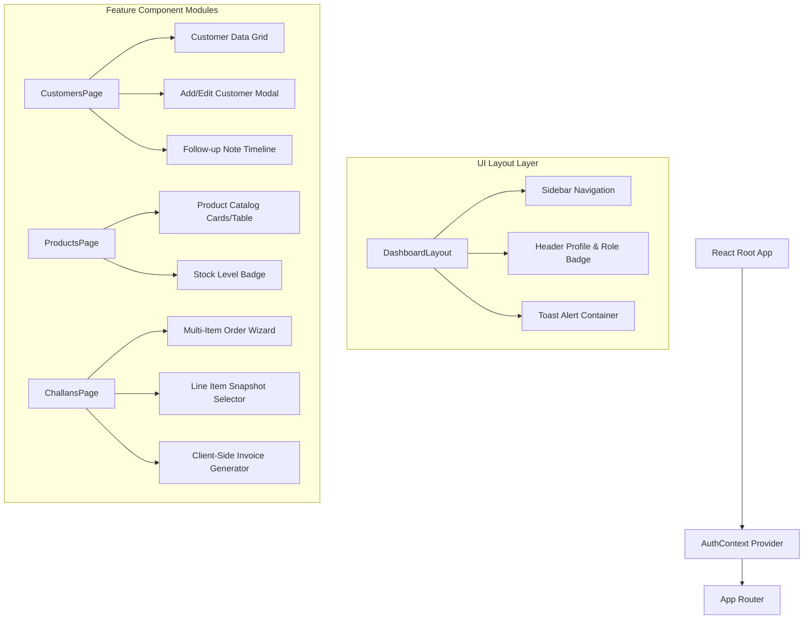

# Subsystem PRD: Frontend Application & UI Guidelines

## 1. UX Guidelines & Design Aesthetics
- **Architecture**: Single Page Application built with React 18, TypeScript, Vite, Tailwind CSS, and Lucide React icons.
- **Design Aesthetic**: Premium corporate dashboard UI with dark/light visual modes, subtle borders, high contrast badges, glassmorphism, and responsive tables.
- **User Feedback**: Interactive toast notifications for API success/error states, loading skeletons, and interactive modal dialogs.

---

## 2. Page & Layout Structure

### 2.1 Router & Page Flow Diagram



### 2.2 Frontend Component Architecture Tree



### 2.3 View Specifications
1. **Login Page (`/login`)**: Role selector / quick-fill demo buttons for test credentials (`Admin`, `Sales`, `Warehouse`, `Accounts`), clean form layout.
2. **Dashboard (`/dashboard`)**: KPI metric cards (Total Customers, Total Stock Units, Active Challans, Monthly Sales Revenue), low-stock warning alert panel, quick activity feed.
3. **Customer CRM Page (`/customers`)**: Paginated customer data grid with status badges, search bar, "Add Customer" modal, follow-up date highlights, and slide-over customer details drawer.
4. **Product Catalog Page (`/products`)**: Grid/Table view of products, stock level status indicator (In Stock, Low Stock, Out of Stock), SKU quick search, product creation drawer.
5. **Inventory Audit Page (`/inventory`)**: Stock adjustment drawer (Stock In / Stock Out form), timeline of audit logs with movement reason tags.
6. **Sales Challan Page (`/challans`)**: Order creation wizard (Customer selection, dynamic line item rows, stock availability checks), Challan status switcher (Draft ➔ Confirm), PDF invoice download button.

---

## 3. Frontend Architecture & Modular Organization

Following the project architecture layout (`C:\Users\sachi\Desktop\f\mini-erp-crm\docs\Recommended project structure.txt`):

```
frontend/src/
├── components/
│   ├── ui/ (Button, Input, Modal, Badge, Toast, Table)
│   ├── layout/ (Sidebar, Navbar, PageContainer)
│   └── common/ (ProtectedRoute, LoadingSpinner, ErrorBoundary)
├── modules/
│   ├── auth/ (LoginPage, AuthContext, authService)
│   ├── customers/ (CustomerListPage, CustomerDetailPage, CustomerFormModal)
│   ├── products/ (ProductListPage, ProductFormModal, StockBadge)
│   ├── inventory/ (InventoryAuditPage, StockAdjustModal)
│   └── challans/ (ChallanListPage, CreateChallanWizard, InvoicePdfView)
├── routes/ (AppRoutes.tsx)
└── services/ (apiClient.ts)
```
