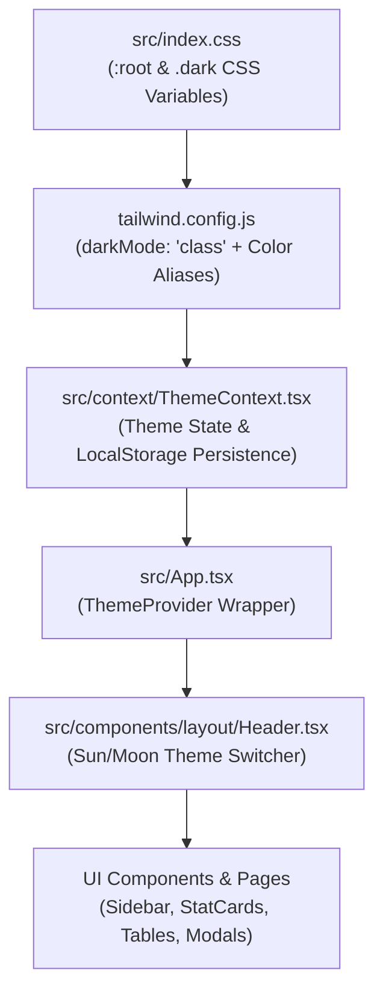

# Theme System Implementation Plan: Dual Palette (Spruce Cream & Dark Mode)

## 1. Objective & Scope
The objective of this plan is to introduce a flexible, global Theme Engine supporting **Light Mode** (custom Spruce & Warm Cream palette) and **Dark Mode** (Deep Midnight Slate/Spruce palette) with an instant toggle control in the header.

---

## 2. Color Palette Specification

### Light Theme Palette (Custom Requested Specs)
| Semantic Role | Target Hex Code | Description |
| :--- | :--- | :--- |
| **Sidebar / Topbar Background** | `#002A1C` | Deep Forest Emerald / Dark Spruce |
| **Main Application Canvas BG** | `#FFFBF7` | Warm Cream / Alabaster Linen |
| **Card & Button Container BG** | `#FFE4C4` | Warm Bisque / Creamy Amber Accent |
| **Border & Divider Lines** | `#F3CEA6` | Soft Terracotta / Warm Muted Apricot Border |
| **Primary Text Color** | `#002A1C` | High Contrast Dark Spruce Text |
| **Secondary / Muted Text** | `#5C4A3A` | Warm Earth Brown Muted Text |

### Dark Theme Palette (Sleek Midnight Operations Mode)
| Semantic Role | Target Hex Code | Description |
| :--- | :--- | :--- |
| **Sidebar / Topbar Background** | `#001C13` | Ultra Dark Spruce |
| **Main Application Canvas BG** | `#090D16` | Deep Midnight Slate |
| **Card & Button Container BG** | `#111827` | Dark Slate Container |
| **Border & Divider Lines** | `#1F2937` | Subtle Dark Border |
| **Primary Text Color** | `#F9FAFB` | Crisp White Text |
| **Secondary / Muted Text** | `#9CA3AF` | Cool Gray Muted Text |

---

## 3. Architecture & Implementation Steps

### Execution Tasks:
1. **Task 1: CSS Variables Setup (`index.css`)**
   Define `--bg-app`, `--bg-sidebar`, `--bg-card`, `--border-color`, `--text-main`, `--text-muted` for `:root` (light) and `.dark` selectors.
2. **Task 2: Tailwind Configuration (`tailwind.config.js`)**
   Enable `darkMode: 'class'` and extend theme colors mapping to CSS variables.
3. **Task 3: Theme Context & Storage (`ThemeContext.tsx`)**
   Create React Theme Provider with `theme` state (`'light'` | `'dark'`) stored in `localStorage`. Automatically toggles the `.dark` class on `document.documentElement`.
4. **Task 4: Header Switcher (`Header.tsx`)**
   Add a Sun / Moon toggle icon button next to the user profile badge.
5. **Task 5: Refactor Components & Pages**
   Update layout containers, sidebars, cards, modals, tables, and buttons to use semantic color classes so they switch dynamically.

---

## 4. Verification & Testing Checklist
- [ ] Theme selection persists across browser refreshes via `localStorage`.
- [ ] Sidebar and Topbar maintain `#002A1C` in Light Mode.
- [ ] Main background smoothly shifts to `#FFFBF7` in Light Mode.
- [ ] Cards & Action Buttons display `#FFE4C4` container fills with `#F3CEA6` borders in Light Mode.
- [ ] Text contrast ratios meet WCAG AA standards in both modes.
